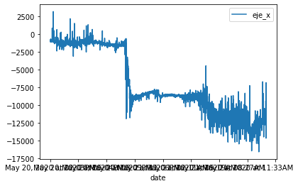
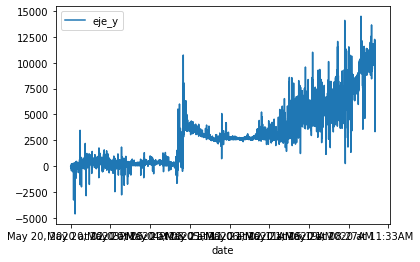
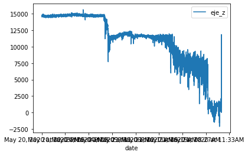
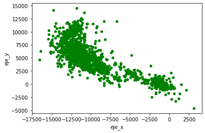
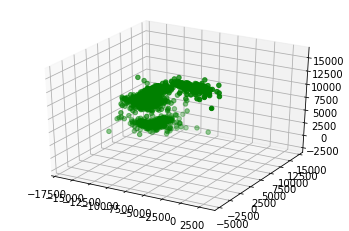
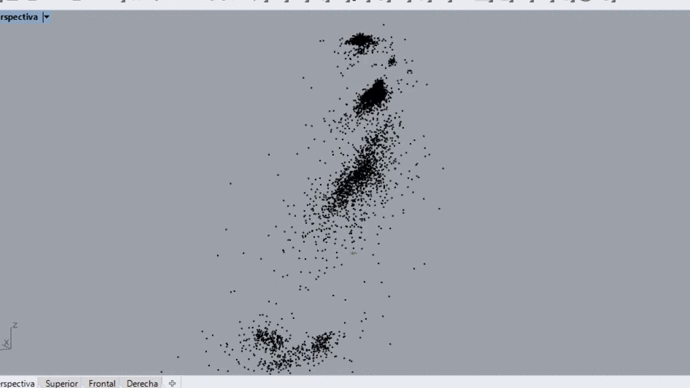

# [proyecto_observatorio](https://nicmotta.github.io/proyecto_observatorio/)
# Sensado de Achira

## Dia 1
### Cantidad datos analizados: 38325
### Progreso eje X:

### Progreso eje Y:

### Progreso eje Z:

### Datos 2D totales:

### Datos 3D totales [nube de puntos / isométrico]:

### Datos 3D totales [nube de puntos / interactivo]:

________________________________________________________________________________________________________________
