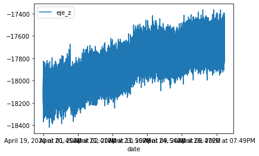

## Semillas de Achira

### Fechas:

- Día 1: 19 abril 2020
- Día 2: 20 abril 2020
- Día 6: 24 abril 2020
- Día 8: 26 abril 2020
- Día 14: 2 mayo 2020
- Día 21: 9 mayo 2020
- Día 28: 16 mayo 2020
- FIN ETAPA 1

## Dia 1
### Primeros datos registrados / 3D:

______________________________________
## Dia 2
### Cantidad de datos analizados: 31920
### Progreso en eje X:

### Progreso en eje Y:

### Progreso en eje Z:

### Datos 2D totales:

### Datos 3D totales [nube de puntos / isométrico]:

______________________________________
## Dia 6
### Cantidad datos analizados: 201420
### Progreso eje X:

### Progreso eje Y:

### Progreso eje Z:

### Datos 2D totales:

### Datos 3D totales [nube de puntos / isométrico]:

### Datos 3D totales [nube de puntos / interactivo]:

______________________________________
## Dia 8
### Cantidad datos analizados: 261420

### Progreso eje X:

### Progreso eje Y:

### Progreso eje Z:

### Datos 2D totales:

### Datos 3D totales [nube de puntos / isométrico]:

### Datos 3D totales [nube de puntos / interactivo]:

______________________________________
## Dia 14
### Cantidad datos analizados: 475275
### Progreso eje X:

### Progreso eje Y:

### Progreso eje Z:

### Datos 2D totales:

### Datos 3D totales [nube de puntos / isométrico]:

### Datos 3D totales [nube de puntos / interactivo]:

______________________________________

## Dia 21
### Cantidad datos analizados: 715270
### Progreso eje X:

### Progreso eje Y:

### Progreso eje Z:

### Datos 2D totales:

### Datos 3D totales [nube de puntos / isométrico]:

### Datos 3D totales [nube de puntos / interactivo]:

______________________________________

## Dia 28
### Cantidad datos analizados: 970475
### Progreso eje X:

### Progreso eje Y:

### Progreso eje Z:

### Datos 2D totales:

### Datos 3D totales [nube de puntos / isométrico]:

### Datos 3D totales [nube de puntos / interactivo]:

____________________________________
